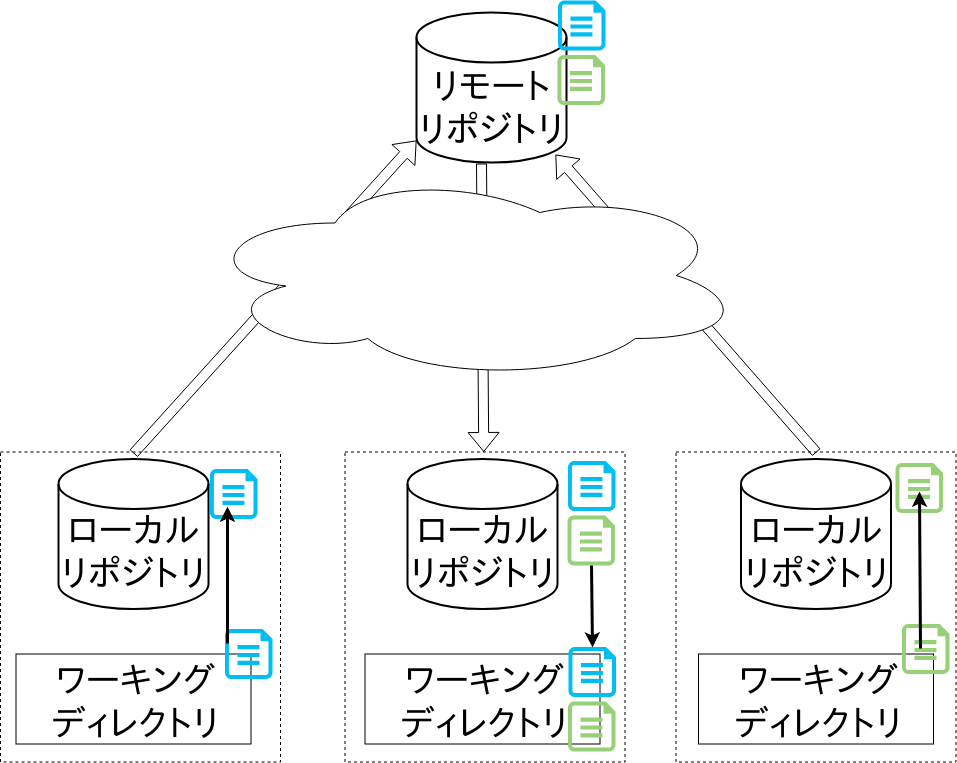
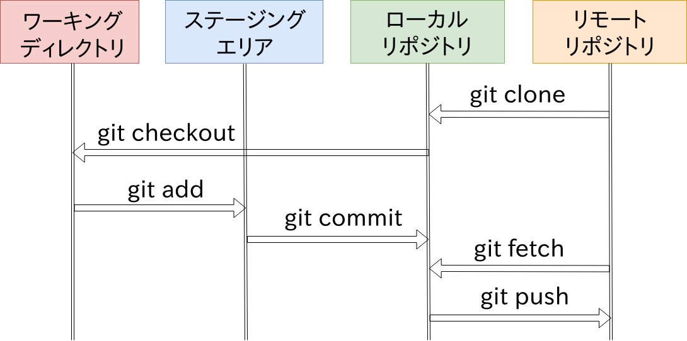

# Git基礎

## アーキテクチャ

### 保存スペース

Gitは以下の3つのスペースを扱い，それぞれの役割を理解し上手く運用することでバージョン管理を行います．

- ワーキングディレクトリ: 実際に作業をするディレクトリ
- ステージングエリア: インデックスと呼ばれる次にリポジトリに納めるべきファイルを収納する場所で，リポジトリへ保存する直前の一時置き場のようなもの
- (ローカル/リモート)リポジトリ: コミット(スナップショット)を保存する場所で，Gitではリモートとローカルの2種類が存在する．


### 分散型

またGitは分散型のバージョン管理システムに分類されます．

各個人がローカル環境にワーキングディレクトリ，ステージングエリア，ローカルリポジトリを保有します．

共有のリモートリポジトリを用意し，手元のローカルリポジトリに保存されたコミットをアップロード(push)，ないしはダウンロード(fetch)することで複数人でのコード管理を実現しています．



## コミット管理のフロー

次の図にコミットがどのようなコマンドで各スペースを往来しているかを示しています．

「自分は今何をやっているんだっけ？」となることもあると思うので，そういったときはこの図を見返すといいかもしれません．



## 実際に使う

次に実際にGitを使っていきましょう．

既にGitがインストール済みの環境があればそちらを使っていただいても構いませんが，環境がなければ[Play with Docker](https://labs.play-with-docker.com)を使いましょう．

Play with Dockerでは初期からgitが入っているので直ぐに始められます．

またエディタはvimが入っていますが，emacsやnanoが使いたい人は`apt-get install emacs`などで導入してください．

__Play with DockerではEscキーが使えません！vimを使う人はEscの代わりにCtrl+cを使ってください！__

またここでは一旦リモートリポジトリのことは忘れてください．

### 設定

Gitは誰が作成したコミットかを残します．

そのため自分が何者であるか，Gitに設定してあげましょう．

```sh
git config --global user.email "<GitHubに登録したメールアドレス>"
git config --global user.name "<GitHubのユーザ名>"
```

設定の反映を確認します．

```sh
# 一覧
git config --global -l
# 設定ファイルは$HOME/.gitcnfigに保存されている
cat $HOME/.gitcnfig
```

Gitはファイルを形式的に処理してあげているので，基本的に`$HOME/.gitconfig`ファイルは`git config`コマンドを通して書き換えましょう．

### ローカルリポジトリの用意

まずはローカルリポジトリ(以降，単にリポジトリとします)を作成しましょう．

```sh
mkdir -p $HOME/workdir/first
cd $HOME/workdir/first
git init
# .git ディレクトリが表示されていれば成功です
ls -a
```

これで`$HOME/workdir/first`がリポジトリになりました．

リポジトリの中身を先程の用語と対応付けると，このようになります．

- ワーキングディレクトリ = リポジトリの.gitディレクトリ以外
- ステージングエリア = .gitディレクトリ配下
- コミット保存場所としてのリポジトリ = .gitディレクトリ配下

### コミットまでの流れ

次にGitのリポジトリに必須のREADME(説明書)を作ります．

```sh
echo "# This Repository is My first repo." > README.md
```

では変更をコミットとして保存していきましょう．

```sh
# ステージングエリアに README.md の変更差分を追加
git add README.md
# ステージングエリアの変更差分をコミットとして残す
git commit -m "Add README.md"
# コミット履歴を確認
git log
```

`git log`コマンドの出力は以下のようになっていると思います．

```sh
 commit 7def8c99a189d50c64ea76baf5cfc51d0b4679ee (HEAD -> maste
r)
 Author: OriishiTakahiro <takahiro0914@live.jp>
 Date:   Tue Apr 9 13:04:46 2019 +0000

 Add README
```

それぞれの意味合いは次の通りです．

- commit: そのコミットを指すコミットID
- Author: コミット主
- Date: コミット作成時刻
- コミットコメント (-m オプションで指定した文字列)

以上がGitの主な流れです．

変更→add→commitの流れを繰り返していくことでワーキングディレクトリでの作業履歴を残していきます．

### 状態の確認

`git status`コマンドではリポジトリの各ファイルの状態を確認できます．

```sh
echo "hoge" > hoge.txt
echo "foo" > foo.txt
git add hoge.txt
# 各ファイルの状態確認
git status
```

`git status`の出力はこんな感じになるはずです．

```sh
On branch master
Changes to be committed:
  (use "git reset HEAD <file>..." to unstage)

        new file:   hoge.txt

Untracked files:
  (use "git add <file>..." to include in what will be committed)

        foo.txt
```

出力の意味合いはそれぞれ

- Changes to be committed: ステージング済み，`git commit`コマンドでコミットになる変更分
- Untracked files: ステージングにすら入っていない

### ファイルの削除

gitで管理するプロジェクトのファイルを削除する場合に気をつけるべきことがあります．

```sh
# カレントディレクトリを指定することで配下全てをaddの対象にできます
git add .
git commit -m "Add foo bar"
```

ここで普通に

```sh
rm hoge.txt
git add .
git commit -m "rm hoge"
```

としても，コミットには`hoge.txt`の削除が__反映されません．__

`git add`コマンドでステージングエリアに登録されるのは__修正か新規作成のみ__です．

ファイルを削除する際は`git rm`コマンドを使いましょう．

```sh
git rm hoge.txt
git status
```

以下のように表示され，`hoge.txt`が削除されたことがステージングエリアに登録されていることがわかります．

```sh
On branch master
Changes to be committed:
  (use "git reset HEAD <file>..." to unstage)

        delet
```

コミットすればhoge.txtはリポジトリから消えます．

```sh
git commit -m "delete hoge"
```

ちなみに間違えて`git rm`を使わずに削除してしまった場合は．`git add`に`-A`オプションをつけて，`git add . -A`とするとちゃんと反映されます．

### 差分の確認

次にコミット間での変更差分を確認しましょう．

`git diff`コマンドを使うとコミット間での変更点が見られます．

ここまでのコマンドを全て実行していれば，`git log`とすると次のようになるはずです．

```sh
commit 40c83b581aac94128a69eef5ee765c6290c872dd (HEAD -> maste
r)
Author: OriishiTakahiro <takahiro0914@live.jp>
Date:   Tue Apr 9 13:29:19 2019 +0000

    delete hoge

commit 0a4a2688320bb54991982e12203d391f27ae4108
Author: OriishiTakahiro <takahiro0914@live.jp>
Date:   Tue Apr 9 13:20:50 2019 +0000

    add foo bar

commit 7def8c99a189d50c64ea76baf5cfc51d0b4679ee
Author: OriishiTakahiro <takahiro0914@live.jp>
Date:   Tue Apr 9 13:04:46 2019 +0000

    Add README.md
```

```sh
# コミットIDを指定して差分を見る
# (コミットIDは一意に特定できればいいので，最初の数桁で指定してもよい)
git diff 0a4a2 40c83b
```

出力は以下のようになります．

```sh
diff --git a/hoge.txt b/hoge.txt
deleted file mode 100644
index 2262de0..0000000
--- a/hoge.txt
+++ /dev/null
@@ -1 +0,0 @@
-hoge
```

### ブランチによる作業フローの分岐

Gitはブランチと呼ばれるコミットの流れを分岐/合流させる機能があります．

ブランチの使い方としては次のようなものがあります．

- 開発ブランチと製品ブランチという形で，最新ではないが確実に動くものを用意しておく
- 開発機能ごとにブランチを分けることで，それぞれのコミットを無駄に干渉させずに開発に集中できる

早速やっていきましょう，今回使用するのは以前説明に使った計算ツールGalcです．

[import](../src/chap2/1st.go)

これを`main.go`として保存してください．

```sh
git add main.go
git commit -m "Start galc project"
```

次にブランチを切って減算機能を追加しましょう．

```sh
# 減算ブランチの追加
git branch dev-sub
```

ここで`git branch`とすると，現在作成されているブランチの一覧が出ます．

```sh
  dev-sub
* master
```

`dev-sub`ブランチは先程作ったブランチで，`master`ブランチはデフォルトで用意されているブランチとなっています．

'\*'が付いているものが自分がいるブランチなので，現在`master`ブランチにいるということになります．

では早速`dev-sub`ブランチに移動しましょう，`git checkout`を使って移動します．

```sh
# dev-subブランチに移動
git checkout dev-sub
# 現在のブランチが切り替わっているか確認
git branch
```

`main.go`を書き換えて減算機能を追加してください．

[import](../src/chap2/1st.go)

```sh
git add main.go
git commit -m "Add 'sub' command"
git log
```

次に`master`ブランチに戻り，commitを確認しましょう．

```sh
git checkout master
git log
```

```
commit 379d446c5114b37a088b769a5ced8bbe4d13afb6 (HEAD -> maste
r)
Author: OriishiTakahiro <takahiro0914@live.jp>
Date:   Tue Apr 9 13:59:53 2019 +0000

    Start galc project

commit 40c83b581aac94128a69eef5ee765c6290c872dd
Author: OriishiTakahiro <takahiro0914@live.jp>
Date:   Tue Apr 9 13:29:19 2019 +0000

    delete hoge

commit 0a4a2688320bb54991982e12203d391f27ae4108
Author: OriishiTakahiro <takahiro0914@live.jp>
Date:   Tue Apr 9 13:20:50 2019 +0000

    add foo bar

commit 7def8c99a189d50c64ea76baf5cfc51d0b4679ee
Author: OriishiTakahiro <takahiro0914@live.jp>
Date:   Tue Apr 9 13:04:46 2019 +0000

    Add READM
```

先程のコミットは`master`ブランチに反映されていませんね?

減算開発終了したので，`dev-sub`のコミットを`master`にマージして変更を`master`に取り込みましょう．

```sh
# 'master'ブランチで行ってくださいね？
git merge dev-sub
# 減算の開発コミットがマージされていることを確認
git log
```

このように

1. 機能開発用ブランチを作成
1. コミットをたくさん作成
1. 統合するブランチに機能開発用ブランチをマージ

のサイクルを繰り返していき，開発を行っていきます．

## 関連ツール

GitにはCLIツールだけだけでなく，ビジュアライズされ，ボタンポチポチでできるGUIツールもあります．

- [GitHub Desktop](https://desktop.github.com/)
- [Sourcetree](https://www.sourcetreeapp.com/)
- [TortoiseGit](https://tortoisegit.org/)
- [Gitkraken](https://www.gitkraken.com/)


またIDEやエディタのプラグインとして，Gitと連携する機能やプラグインが多く，そちらを使うのもいいと思います．

- IntelliJ IDEA
- Android Studio
- Atom
- Visual Studio Code

## Tips

### logの表示オプション

### commitやりなおし

### addを取り消したい

### ブランチを切る前にcommitしそこねた

## 差分の保存

__ちょっと発展的な話になってくるので，興味のない方は本節を飛ばしてしまっても構いません．__

ここでは各スペースの内部構造をみていくことで，Gitがどのようにデータを管理しているか見ていきます．

開発者手元の環境ではGitは次の3つのスペースを利用すると述べました．

- ワーキングディレクトリ
- ステージングエリア
- ローカルリポジトリ

スナップショットやその関係データはワーキングディレクトリのルート直下，`.git`という隠しディレクトリに保持されています．

.git内部は

- オブジェクトデータベース (.git/objects)  
  コミットオブジェクト群
- カレントディレクトリキャシュ (.git/objects)

で構成されています．

