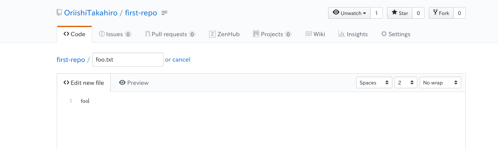

# GitHubと合わせて

[Gitの基礎](chap2.md)ではGitのローカルにおける開発フローは体験できたと思います．

単純に手元のプロジェクトをバージョン管理するだけであればこれらで十分ですが，Gitは[分散型バージョン管理システム](chap2.md#分散型)であり，リモートリポジトリを活用することで複数人での開発や手元のデータ消失などに強いというGitの恩恵を享受することができます．

Gitのリモートリポジトリサーバは自分で立てることもできますが，以下のようなサービスとしてリモートリポジトリを提供するホスティングサービスもあります．

- GitHub
- GitLab
- Bitbucket
- CloudForge
- tracpath
- AWS CodeCommit
- GCP Cloud Source Repositories

本章では，Microsoft社が提供するGitHubを使った開発フローを体験していきます．

(なお本記事もGitHubで[プロジェクト管理](https://github.com/OriishiTakahiro/git-intro)しています)

## リモートリポジトリの使い方

GitHubのアカウント作成やMFA(Multi Factor Authentication)の設定は済んでいることを前提としています．

### 下準備

#### 認証鍵の作成

GitHubを使用する際は，Gitのクライアントがアカウント認証を行います．

この際にIDとパスワードを使用する方法もあるのですが，クライアント保存されてしまうのでセキュリティ上あまりよろしくありません．

特にPlay with Dockerを使っている場合は環境自体が第三者によってホストされているので，そういうことをされるとは信じたくないですが可能性はゼロとは言えません．

そこで基本的にGitHubでは公開鍵認証を用いたアカウント認証を行います．

公開鍵認証であれば，パスワードなどのクレデンシャル情報をクライアントに保存しなくてもいいですし，GitHub側で公開鍵を無効にすれば以降悪用の心配はありません．

__注意__
> GitHubではパスワードベース認証と公開鍵認証で接続プロトコルが異なります．
> 上手く行かないときは正しいプロトコルが使えているか，確認をしてください．
> - パスワードベース認証であればHTTPS
> - 公開鍵認証であればSSH

まずクライアント側で非対称鍵を生成します．
```sh
cd $HOME/.ssh
# パスワードは空で大丈夫です．
# ファイル名を訊かれるので"github-ssh"としてください．
$ ssh-keygen -t rsa
# 秘密鍵 "git-ssh", 公開鍵 "github-ssh.pub" ができていると思います
$ ls
```

__注意__
> デフォルトの鍵名は多くの環境で`id_rsa`となりますが，ファイル名を指定しないと他の鍵を上書きする可能性があるため，他サーバなどへのSSHができなくなる可能性があります．

__注意__
> 拡張子".pub"が付いていないファイルは秘密鍵となり，これが漏洩すると悪用し放題となるので，何らかの理由で流出した場合は__必ず秘密鍵と公開鍵両方を破棄する__ようにしてください．

次に`$HOME/.ssh/config`ファイルを作成し，以下の内容を書き込んでください．

[import](../src/chap3/ssh-config)

通常SSHクライアントはデフォルトでid\_rsaの名前の鍵を使おうとしますが，ここではgithub.comへのSSHアクセス時に先程作成した鍵を使うよう指定しています．

#### 公開鍵の登録

先程作成したgithub-sshをGitHubのアカウントに紐づけます．

ブラウザからgithub.comにログインし，トップページ右上のユーザアイコンをクリック，Setting項目をクリックします．

(左側のアイコン画像クリックでもイケます!)


"Personal settings" → "SSH and GPG keys" → "New SSH keys"

とクリックします．

```sh
# 公開鍵の内容を表示し，コピーします
$ cat $HOME/.ssh/github-ssh.pub
```

Titleには適当な名前を入力し，Keyには`github-ssh.pub`の内容テキストをコピペします．

"Add SSH Key"をクリックすると公開鍵の登録が完了します．

### リモートリポジトリの作成

いよいよリモートリポジトリを作っていきます．

トップページへ戻り，"Start a Project"をクリック．

次の内容でリポジトリを作成してください．
- リポジトリ名は"first-repo"
- "Initialize this repository with a README"にチェック


ここで各情報の説明をすると，

- Repository Name: リポジトリ名
- Description: リポジトリの簡単な説明
- Public/Private: リポジトリを公開/非公開で作成 (公開すると誰でも閲覧が可能になる)
- Initialize this repository with a README: README.mdだけが入ったリポジトリで作成するか否か

> Initialize this repository with a README
> リポジトリを初期化するか否かについては，以下の判断で行ってください．
> 細かい説明は省きますが，判断基準はこんなかんじで大丈夫です．
> - ローカルでリポジトリを作成していない → 初期化する
> - 既にローカルでリポジトリを作成済み → 初期化しない

するとこのようなリモートリポジトリのページが表示されるはずです．


### リモートリポジトリのクローン

リポジトリを作成すると，リポジトリの画面にたどりつきます．

画面左の緑のボタン"Clone or download"をクリックすると，リモートリポジトリのURLが表示されます．


__SSHプロトコルを使用しているかを確認__し，URLをコピーします．

ここでコピーしたURLからリポジトリをダウンロードしてきましょう，`git clone`コマンドで行います．

```sh
$ cd $HOME/workdir
# リポジトリのダウンロード
$ git clone <リポジトリのURL>
# リポジトリがダウンロードできたか確認
$ ls
```

リポジトリにはリモートリポジトリが設定でき，これは`git remote`コマンドを利用して設定や確認ができます．

```sh
$ cd $HOME/workdir/first-repo
# リモートリポジトリの確認
$ git remote -v
```

すると以下のような出力が得られると思います．

```sh
> origin  git@github.com:OriishiTakahiro/first-repo.git (fetch)
> origin  git@github.com:OriishiTakahiro/first-repo.git (push)
```

ここでは識別名"origin"で"github.com:OriishiTakahiro/first-repo.git"のリモートリポジトリが登録されています．

デフォルトの識別名は"origin"となっていますが，識別名さえことなれば幾つでもリモートリポジトリは登録できます．

```sh
# リモートリポジトリの追加
$ git remote add <識別名> <URL>
# リモートリポジトリの削除
$ git remote <識別名>
# リモートリポジトリの変更
$ git remote set-url <識別名> <URL>
```

とすることでリモートリポジトリの設定ができます．

したがってリモートリポジトリは複数存在する可能性があるため，リモートリポジトリとのやり取りは識別名を利用して行います．

### コミットのアップロード

では実際に変更を加えてコミットを作成しましょう．

```sh
$ cd $HOME/workdir/first-repo
$ echo "hoge" > hoge.txt
$ git add hoge.txt
$ git commit -m "Add hoge"
```

次に`git push`コマンドでリモートリポジトリへコミットをアップロードします．

```sh
# originサーバのmasterブランチにアップロード
$ git push origin master
```

GitHubのリポジトリのページをリロードしてみてください，`hoge.txt`が追加されているはずです．

### コミットのダウンロード

次にリモートリポジトリからコミットをダウンロードしてきましょう．

実はGitHubのリポジトリページから直接編集してコミットできます．

試しに`foo.txt`を追加しましょう，GitHubのリポジトリページから"Create new file"をクリックしてください．




`foo.txt`が追加されていると思うので，`git pull`でローカルにダウンロードしましょう！

```sh
# コミットのダウンロード
$ git pull origin
# "foo.txt" を追加したコミット履歴があるか確認
$ git log
```

リモートリポジトリ(ここではGitHub)を交えた一連の操作の流れは以上となります．
