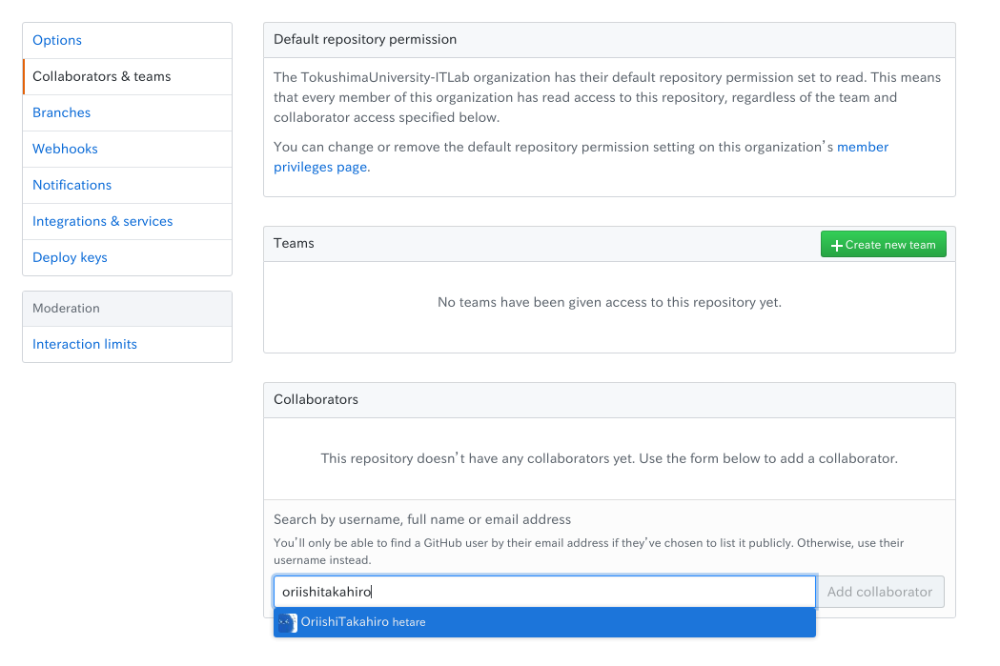
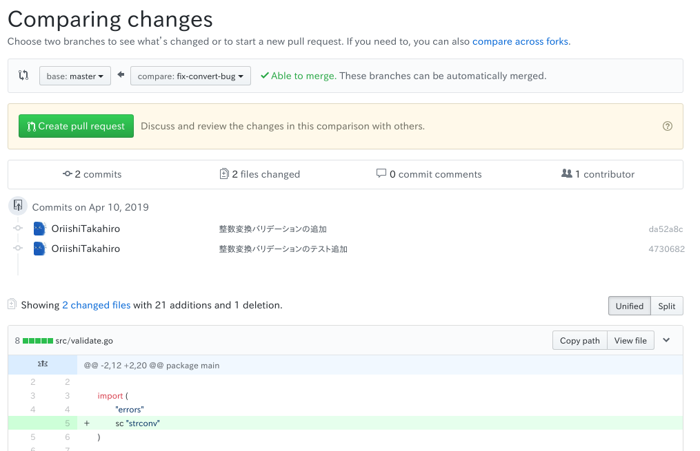
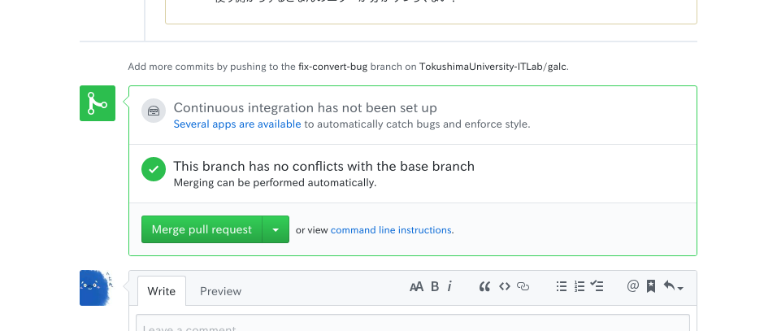

# チームで使うGit

本章では実際にチーム単位でGitHubを使ったコラボレーション演習をしてもらいます．

ここからは少々ハードになるので頑張ってくださいね？

## チーム結成

まずはチームを作りましょう．

2, 3人程度で1チームです．

お互いに自己紹介をし，握手を交わし，ぱぱっと友情を深めましょう．

次にリーダーを決めてください．

特に失敗した責任を取るといったことはありません．純粋にスピード感をもって進めるために「意思決定がなかなかできないときにさっさと決断を下す人」，「あまりうまくいかないときに相談出来る人」程度の感覚です．

## 下準備

### リポジトリのフォーク

まず[galcのリポジトリ](https://github.com/OriishiTakahiro/galc)を見てください．

こちらが今回用意した練習用プロジェクトです．


リーダはこのリポジトリをフォーク(リポジトリそのもののブランチを作るようなこと)してください．

リポジトリ右上の"Fork"ボタンをクリックするとできます．

### 開発メンバーの招待

フォークしたリポジトリは自分しか触ることができませんので，同じチームのメンバーを招待しましょう．

フォークしたリポジトリから"Settings" → "Collaborators & teams"と移動し，画面下部の入力欄にチームメンバーの名前を入れ，"Add Collaborator"をクリック．





招待されたメンバーはGitHubアカウントに登録したメールアドレスに招待メールが来るので，招待を承諾し，チームリーダーにお礼を言いましょう．

またここでチームリーダは"Settings"の"issues"にチェックを入れてください．


### ソースコードを読む

とりあえずソースコードを読んでください．

そして全体の流れを理解してください．

読むコードは`/src`ディレクトリ配下だけでいいです．

`*_test.go`ファイルはテストコードのファイルです．

### 取り組むIssueを決める

まずプロジェクトページ上部のIssuesからIssue一覧を開き，各メンバーが取り組むべき問題を決めましょう．

Issueは全部で10個あります．


なんとな嘆かわしいことに！フォークではIssueが引き継がれません！

なので，[元のリポジトリ](https://github.com/OriishiTakahiro/galc)からコピペして登録しましょう．Issueを登録するいい練習になりますね♪ (白目

IssueにはIssue番号が付与されていますが，取り組む際は元のリポジトリのIssue番号にそって昇順で取り組んでくださいね．

(あ，でも原則Issue番号8番以外は1 Issue/人ですよ？)

## 開発

ここではIssue番号1番に取り組む人の場合について書きます．

(それ以外の人は適宜読み替えてね)

さて，これまでの学習の集大成だ！

### リポジトリのクローン

```sh
cd $HOME/workdir
git clone <フォークしたリポジトリのURL>
cd galc
# 取り敢えず動かしてみる
./run.sh add 3 5
./test.sh
```

### 機能開発ブランチの作成

```sh
# ブランチ名はそれぞれが相応しい名前を考えてね?
git branch fix-convert-bug
git checkout fix-convert-bug
```

### コミットの作成とプッシュ

`./src/validate.go`を以下のように書き換える．

[import](../src/chap4/validate.go)

```sh
# テストが全て通ることを確認
./test.sh
# コミットを作成
git add src/validate.go
git commit -m "整数変換バリデーションの追加"
```

`./src/validate_test.go`を以下のように書き換える．

[import](../src/chap4/validate_test.go)

```sh
# テストが全て通ることを確認
./test.sh
# コミットを作成
git add src/validate.go
git commit -m "整数変換バリデーションのテスト追加"
```

コミットをpushしますが，この際に__リモートリポジトリの"master"ブランチではなく，自分が作成した名前と同じリポジトリにpushするようにしてください__．

``` sh
# ブランチ名の確認
git branch
# コミットをpush
git push origin <自分の作ったブランチ名>
```

## マージの承認フロー

### プルリクエストの作成

GitHubの複数人開発では，直接誰かがCLIでマージするのではなく，"Pull Request"というものを発行し，それにIssueとブランチを紐づけて管理します．

まとめるとこんな感じです．

- Issue: 問題/課題
- Branch: Issueを解決するための一連のコミット
- Pull Request: Branchをマージするための要求

プロジェクト画面上部の"Pull Requests"を開くと空のプルリクエスト一覧が出てきます．


"New Pull Request"を選ぶと，どのブランチからどのブランチへのマージなのかを選択します．

わかりにくいかも知れませんが，フォーク先の自分のブランチをフォーク先のmasterブランチにマージしてください．

矢印の向きに気をつけてくださいね？

左がmasterブランチ，右が自分のブランチです．

するとこのようにブランチ間の差分が出てきます．



最後にプルリクエストの詳細情報をコメントしてプルリクの完成です．


### レビュー

発行されたプルリクエストはチーム内でレビューしましょう．

"File Changes"からは特定の行にコメントを入れることもできます．


"Conversation"からはコメントを見たり入力したりできます．


### マージ

1. コメントでの殴り合い
1. コードの修正
1. プッシュ

のサイクルをある程度こなし，全員が納得できるものができれば最後にマージしましょう．



"Merge Pull Request"ボタンを押し，全員が承認すると，あなたの変更は無事masterブランチに取り込まれます．

マージされていることを確認しましょう．

```sh
git checkout master
git pull
git log
```

これでIssueは一つ解決しました，IssueをClosed状態にしましょう！


以上で本章の内容は終わりです，お疲れ様でした．
あとは残りのIssueを頑張ってください！
