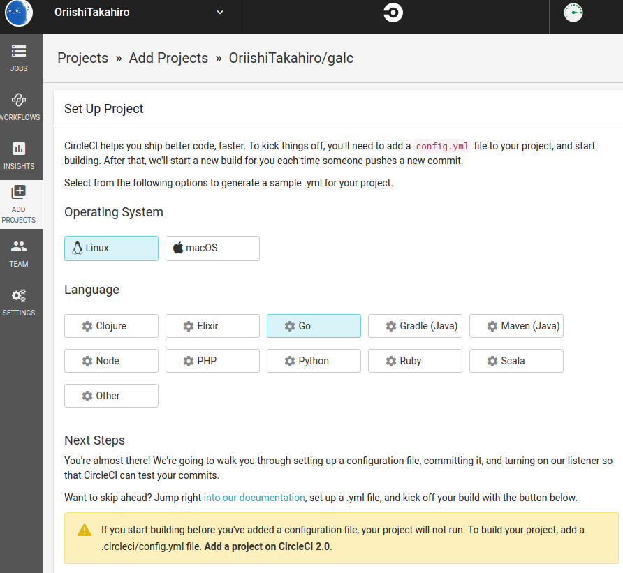

# Tips

## CircleCI

### Circle CIとは?

[Circle CI](https://circleci.com/)はGitHubとの連携が可能なCI(Continuous Integration)サービスです．

CIは開発者がリポジトリにプッシュするのを検知し，ビルドとテスト，更には開発者への通知をツールが自動で行うことで開発以外の負担を減らす手法になります．

CIサービスには以下のようなものがあります．

- [Circle CI](https://circleci.com/)
- [Travis CI](http://travis-ci.com/)
- [Shippable](https://www.shippable.com/)
- [Codeship](https://www.codeship.io/)
- [AWS CodePipline]()
- [GCP CodePipline]()

また[Jenkins]()などのOSSを利用し，自らのサーバにCIツールを乗せることも可能です．

### Circle CIを使ってみる

まずは[ログイン画面](https://circleci.com/vcs-authorize/)からログインしましょう，アカウントはGitHubのものがそのまま使えます．


"ADD PROJECTS"から"galc"のプロジェクトを探し，"Set Up Project"でプロジェクトをCircle CIのビルド対象としましょう．


Circle CIでは[YAML](https://yaml.org/spec/history/2001-05-26.html)と呼ばれるマークアップ形式で設定を記述します．

プロジェクト追加後に表示される次の画面では，主要な言語における設定ファイルのテンプレートを入手することができるので，ここでは"Linux"と"Go"を選択してテンプレートを入手しましょう．



テンプレートは`.git`のあるディレクトリ直下に`.circleci/config.yml`として保存します．

```sh
mkdir .circleci
touch .circleci/config.yml
```

テンプレートの`ORG_NAME`と`REPO_NAME`を，GitHubのユーザ名とプロジェクト名に書き換えて`.circleci/config.yml`に記述しましょう，ユーザ「OriishiTakahiro」でプロジェクト「galc」の場合はこうなります．

```sh
git add .
git commit -m "Setup CI"
git push origin master
```

しばらくすると，JOBSの一覧にテストの結果が表示されます．


## OSSライセンス

就職後の自社開発などプライベートリポジトリでの開発に関しては，あまり関係のない話かもしれませんが，もしみなさんがOSS(Open Source Software)の開発をパブリックリポジトリで行うのであれば，改変や再配布に関するライセンス表記をしておいたほうが無難かもしれません．

何も表示しない[No License](https://choosealicense.com/no-permission/)であれば複製や再配布，修正に関する行為が他の誰にも権利を与えませんということになります．

主なOSSライセンスは次のようなものがあり，MITライセンスが一番制約がゆるいです．

- MIT
- Apache License 2.0
- GNU General Public License v3.0
- BSD 3-Clause
- No License

これら主要なOSSライセンスはGitHub上でプロジェクト作成時の`README.md`を初期化する際に，最初から含めるように設定することもできます．


## ログの表示オプション

`git log`コマンドを実行する際，デフォルトでは欲しい情報が分かりづらいことも多いかと思います．

そこでここではよく使うオプションを紹介します．

```sh
# 他ブランチも表示
git log --branches
# リモートリポジトリの他ブランチも表示
git log --branches --remotes
# 簡潔に一行で表示
git log --oneline
# 直近5コミットのみ表示
git log -n 5
# グラフ形式で表示
git lo --graph
```

また，特定の言語やフレームワークについて`.gitignore`を生成してくれ[gibo](https://github.com/simonwhitaker/gibo)というツールも存在します．

## コミットに残したくないファイルがある

リポジトリには，シークレット情報やログファイル，バイナリファイル，メタデータファイルなどコミットに残したくないファイルが生じる場合があります．

`git add`実行時に対象に含めなければよい...のは正しいですが，非常に面倒ですし，Gitはもっと良い解決策を用意してくれています．

それが`.gitignore`という隠しファイルで，そちらにGitで管理したくないファイル名を記述することでコミットの対象になることから免れます．

ためしに作ってみましょう．

```sh
# 適当なろリポジトリを作成
mkidr $HOME/test-repo
cd $HOME/test-repo
mkdir logs
git init
```

次のソースコードを`main.go`として保存

[import](../src/chap5/main.go)

次のコードを`.gitignore`として保存

[import](../src/chap5/gitignore)

```sh
# Dockerを使って，hello-binの名前でバイナリファイルをビルド
sudo docker run -v ${PWD}:/go golang go build main.go -o hello-bin 
# 実行してログファイルを生成
for i in `seq 1 10`; do; ./hello-bin hoge; sleep 1; done
ls logs
# ステージングされていないことを確かめる
git add .
```


## ファイルでなくディレクトリのみコミットしたい

`.gitignore`ファイルを使うと，特定のファイルをコミット対象に含めないことが可能であると学びました．

しかしこの手法では`logs`ディレクトリがコミットされず，クローンしてそのまま実行しようとすると「`logs`ディレクトリなんてないよ！」と怒られてしまいます．

そこで隠しファイル`.gitkeep`を使ったディレクトリだけを残すテクニックがあります．

`.gitignore`を以下のように書き換えてください．

[import](../src/chap5/gitignore-keep)

```sh
# .gitkeepファイルをlogsディレクトリに追加
touch logs/.gitkeep
# ステージングされていることを確認
git add .
git status
```
